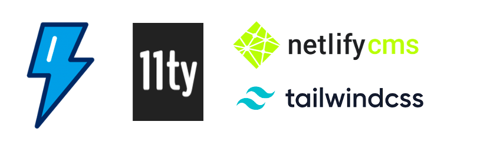

# lwc-blog-template

 

A starter repository showing how to build a blog using [Lightning Web Components](https://lwc.dev/), [Eleventy](https://www.11ty.dev/) static site generator, [Tailwind CSS](https://tailwindcss.com/) and [Netlify CMS](https://www.netlifycms.org/)

## Check out the Live Versions

-   [Netlify](https://lwc-blog-template.netlify.app)
-   [GitHub Pages](https://adityanaag3.github.io/lwc-blog-template)
-   [Heroku](https://lwc-blog-template.herokuapp.com/)

## Deploy this to your own site

-   Clone this repository
-   Update the fields in [`blog.js`](./config/blog.js) according to your needs
-   Update your details on the `<profile-card>` tag in the [`about.html`](src/pages/about/about.html) file.
-   Update the repository name on Line 4 in [`config.yml`](./src/admin/config.yml) with your repository
-   Clear the posts present in the `src/posts` folder
-   Push the code to your repository
-   Deploy the site to your preferred platform
-   To add new posts, go to the URL `<your_blog_url>/admin`
